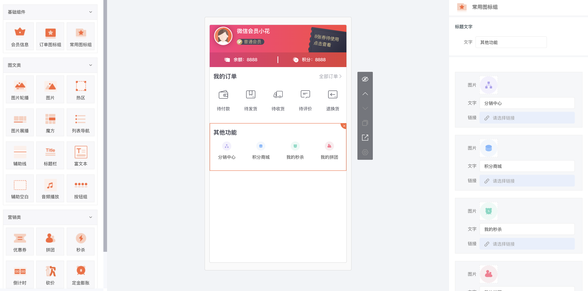

<br>

<p align="center">
  
</p>

<br>

## 介绍

- 基于 VUE 和 Element
- 自定义小程序功能
- 商品 SKU
- 链接弹窗选择器
- 图片弹窗选择器，包含图片分组，图片分页查询，图片删除等
- 二次封装`tinymce`，增加中文字体包，整合弹窗选择器

## 截图

<p align="center">
  
</p>

<br>

## 安装

```shell
npm install openants -S
or
yarn add openants
```

## 快速开始

中文文档：http://docs.unpor.com/docs/openants_for_vue/openants_for_vue-1c9f9qf36cnl9  
OpenAnts 组件是基于 Element 开发，所以在你安装安装 OpenAnts 我们将自动帮你安装 ElementUI，而无需你自己安装，我们建议 elementUI 全局引入！

### 全局使用 OpenAnts

main.js 中的配置

```javascript
import Vue from "vue";
import ElementUI from "element-ui"; // 需要引入 element-ui
import "element-ui/lib/theme-chalk/index.css"; // 需要引入 element-ui 的主题文件
import OpenAnts from "openants"; // 需要引入 OpenAnts
import App from "./App.vue";

Vue.use(ElementUI); // 将 ElementUI 组件注册到VUE
Vue.use(OpenAnts); // 将 ElementUI OpenAnts

new Vue({
  el: "#app",
  render: h => h(App)
});
```

### 按需使用 OpenAnts

main.js 中的配置

```javascript
import Vue from "vue";
import ElementUI from "element-ui"; // 需要引入 element-ui
import "element-ui/lib/theme-chalk/index.css"; // 需要引入 element-ui 的主题文件
import { btn, xxx } from "openants"; // 需要引入 OpenAnts
import App from "./App.vue";

Vue.use(ElementUI); // 将 ElementUI 组件注册到VUE
Vue.component(btn.name, btn);
Vue.component(xxx.name, xxx);
/* 或写为
 * Vue.use(btn)
 * Vue.use(xxx)
 */

new Vue({
  el: "#app",
  render: h => h(App)
});
```

## 教程

http://docs.unpor.com/docs/openants_for_vue/openants_for_vue-1c9f9qf36cnl9
